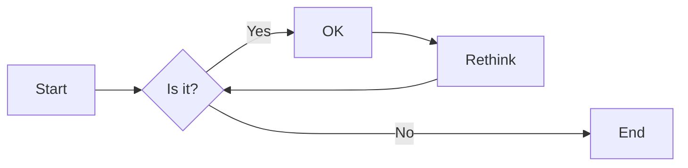
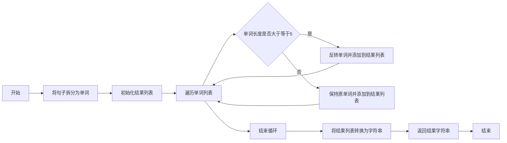

# 实验五 Python数据结构与数据模型

班级： 21计科02

学号： 20210302221

姓名： 王日晖

Github地址：<https://github.com/wrrh>

CodeWars地址：<https://www.codewars.com/users/wrhh>

---

## 实验目的

1. 学习Python数据结构的高级用法
2. 学习Python的数据模型

## 实验环境

1. Git
2. Python 3.10
3. VSCode
4. VSCode插件

## 实验内容和步骤

### 第一部分

在[Codewars网站](https://www.codewars.com)注册账号，完成下列Kata挑战：

---

#### 第一题：停止逆转我的单词

难度： 6kyu

编写一个函数，接收一个或多个单词的字符串，并返回相同的字符串，但所有5个或更多的字母单词都是相反的（就像这个Kata的名字一样）。传入的字符串将只由字母和空格组成。只有当出现一个以上的单词时，才会包括空格。
例如：

```python
spinWords( "Hey fellow warriors" ) => returns "Hey wollef sroirraw" 
spinWords( "This is a test") => returns "This is a test" 
spinWords( "This is another test" )=> returns "This is rehtona test"
```

代码提交地址：
<https://www.codewars.com/kata/5264d2b162488dc400000001>

提示：

- 利用str的split方法可以将字符串分为单词列表
例如：

```python
words = "hey fellow warrior".split()
# words should be ['hey', 'fellow', 'warrior']
```

- 利用列表推导将长度大于等于5的单词反转(利用切片word[::-1])
- 最后使用str的join方法连结列表中的单词。

---

#### 第二题： 发现离群的数(Find The Parity Outlier)

难度：6kyu

给你一个包含整数的数组（其长度至少为3，但可能非常大）。该数组要么完全由奇数组成，要么完全由偶数组成，除了一个整数N。请写一个方法，以该数组为参数，返回这个 "离群 "的N。

例如：

```python
[2, 4, 0, 100, 4, 11, 2602, 36]
# Should return: 11 (the only odd number)

[160, 3, 1719, 19, 11, 13, -21]
# Should return: 160 (the only even number)
```

代码提交地址：
<https://www.codewars.com/kata/5526fc09a1bbd946250002dc>

---

#### 第三题： 检测Pangram

难度：6kyu

pangram是一个至少包含每个字母一次的句子。例如，"The quick brown fox jumps over the lazy dog "这个句子就是一个pangram，因为它至少使用了一次字母A-Z（大小写不相关）。

给定一个字符串，检测它是否是一个pangram。如果是则返回`True`，如果不是则返回`False`。忽略数字和标点符号。
代码提交地址：
<https://www.codewars.com/kata/545cedaa9943f7fe7b000048>

---

#### 第四题： 数独解决方案验证

难度：6kyu

数独背景

数独是一种在 9x9 网格上进行的游戏。游戏的目标是用 1 到 9 的数字填充网格的所有单元格，以便每一列、每一行和九个 3x3 子网格（也称为块）中的都包含数字 1 到 9。更多信息请访问：<http://en.wikipedia.org/wiki/Sudoku>

编写一个函数接受一个代表数独板的二维数组，如果它是一个有效的解决方案则返回 true，否则返回 false。数独板的单元格也可能包含 0，这将代表空单元格。包含一个或多个零的棋盘被认为是无效的解决方案。棋盘总是 9 x 9 格，每个格只包含 0 到 9 之间的整数。

代码提交地址：
<https://www.codewars.com/kata/63d1bac72de941033dbf87ae>

---

#### 第五题： 疯狂的彩色三角形

难度： 2kyu

一个彩色的三角形是由一排颜色组成的，每一排都是红色、绿色或蓝色。连续的几行，每一行都比上一行少一种颜色，是通过考虑前一行中的两个相接触的颜色而产生的。如果这些颜色是相同的，那么新的一行就使用相同的颜色。如果它们不同，则在新的一行中使用缺失的颜色。这个过程一直持续到最后一行，只有一种颜色被生成。

例如：
```python
Colour here:            G G        B G        R G        B R
Becomes colour here:     G          R          B          G
```


一个更大的三角形例子：

```python
R R G B R G B B
 R B R G B R B
  G G B R G G
   G R G B G
    B B R R
     B G R
      R B
       G
```

你将得到三角形的第一行字符串，你的工作是返回最后的颜色，这将出现在最下面一行的字符串。在上面的例子中，你将得到 "RRGBRGBB"，你应该返回 "G"。
限制条件： 1 <= length(row) <= 10 ** 5
输入的字符串将只包含大写字母'B'、'G'或'R'。

例如：

```python
triangle('B') == 'B'
triangle('GB') == 'R'
triangle('RRR') == 'R'
triangle('RGBG') == 'B'
triangle('RBRGBRB') == 'G'
triangle('RBRGBRBGGRRRBGBBBGG') == 'G'
```

代码提交地址：
<https://www.codewars.com/kata/5a331ea7ee1aae8f24000175>

提示：请参考下面的链接，利用三进制的特点来进行计算。
<https://stackoverflow.com/questions/53585022/three-colors-triangles>

---

### 第二部分

使用Mermaid绘制程序流程图

安装VSCode插件：

- Markdown Preview Mermaid Support
- Mermaid Markdown Syntax Highlighting

使用Markdown语法绘制你的程序绘制程序流程图（至少一个），Markdown代码如下：

![程序流程图]

显示效果如下：


## 实验过程与结果

请将实验过程与结果放在这里，包括：

- [第一部分 Codewars Kata挑战](#第一部分)
- [第二部分 使用Mermaid绘制程序流程图](#第二部分)

注意代码需要使用markdown的代码块格式化，例如Git命令行语句应该使用下面的格式：

第一题： 停止逆转我的单词

显示效果如下：

```python
def spin_words(sentence):
    words = sentence.split()
    res = []
    for word in words:
        if len(word) >= 5:
            res.append(word[::-1])
        else:
            res.append(word)
    return ' '.join(res)
```
第一题： 停止逆转我的单词[程序流程图]

显示效果如下：


第二题： 发现离群的数（Find The Parity Outlier）

显示效果如下：

```python
def find_outlier(integers):
    even_nums = []
    odd_nums = []
    for num in integers:
        if num % 2 == 0:
            even_nums.append(num)
        else:
            odd_nums.append(num)
        if len(even_nums) > 1 and len(odd_nums) == 1:
            return odd_nums[0]
        elif len(odd_nums) > 1 and len(even_nums) == 1:
            return even_nums[0]
    return None
```
第三题： 检测Pangram

显示效果如下：

```python
def is_pangram(s):
    letters = [char.lower() for char in s if char.isalpha()]
    unique_letters = set(letters)
    return len(unique_letters) == 26
```
第四题： 数独解决方案验证

显示效果如下：

```python
def validate_sudoku(board):
    elements = set(range(1, 10))
    for b in board:
        if set(b) != elements: 
            return False
    for b in zip(*board):  
        if set(b) != elements: 
            return False
    for i in range(3, 10, 3):
        for j in range(3, 10, 3):
            if elements != {(board[q][w]) 
                            for w in range(j-3, j) 
                            for q in range(i-3, i)}:
                return False
    return True
```
第五题： 疯狂的彩色三角形

显示效果如下：

```python

```
代码运行结果的文本可以直接粘贴在这里。

## 实验考查

请使用自己的语言并使用尽量简短代码示例回答下面的问题，这些问题将在实验检查时用于提问和答辩以及实际的操作。

1. 集合（set）类型有什么特点？它和列表（list）类型有什么区别？
```
   集合（set）类型的特点是：
   - 集合中的元素是无序的，每个元素都是唯一的。
   - 可以使用大括号`{}`或`set()`函数来创建集合。
   - 集合中的元素可以是任意不可变的数据类型，如整数、浮点数、字符串、元组等。

   与列表（list）类型的区别在于：
   - 列表中的元素是有序的，每个元素可以重复。
   - 列表使用方括号`[]`来表示。
```
2. 集合（set）类型主要有那些操作？
```
   集合（set）类型主要有以下操作：
   - 添加元素：使用`add()`方法或直接使用`{}`进行添加。
   - 删除元素：使用`remove()`方法或`discard()`方法。
   - 判断元素是否存在：使用`in`关键字。
   - 集合运算：如并集、交集、差集等。
```
3. 使用`*`操作符作用到列表上会产生什么效果？为什么不能使用`*`操作符作用到嵌套的列表上？使用简单的代码示例说明。
```
   使用`*`操作符作用到列表上会复制列表中的元素多次，例如：
```
```python
numbers = [1, 2, 3]
result = numbers * 3
print(result)  # 输出 [1, 2, 3, 1, 2, 3, 1, 2, 3]
```
```
不能使用`*`操作符作用到嵌套的列表上，因为乘法操作符只能用于数字和字符串，而不能用于列表。如果需要复制嵌套的列表，可以使用循环或列表解析。
```
4. 总结列表,集合，字典的解析（comprehension）的使用方法。使用简单的代码示例说明。
```
列表、集合和字典的解析（comprehension）用于快速创建新的列表、集合或字典。
```
```
- 列表解析：
  - 使用方括号`[]`来创建新的列表。
  - 可以通过对一个可迭代对象进行迭代，并应用条件判断和表达式，生成新的元素。
  - 示例：
```
```python
    numbers = [1, 2, 3, 4, 5]
    squares = [x**2 for x in numbers if x % 2 == 0]
    print(squares)  # 输出 [4, 16]
```
```
- 集合解析：
  - 使用大括号`{}`来创建新的集合。
  - 可以通过对一个可迭代对象进行迭代，并应用条件判断，生成新的元素。
  - 示例：
 ```python
    numbers = [1, 2, 3, 4, 5]
    squares_set = {x**2 for x in numbers if x % 2 == 0}
    print(squares_set)  # 输出 {16, 4}
```
```
- 字典解析：
  - 使用大括号`{}`来创建新的字典。
  - 可以通过对一个可迭代对象进行迭代，并应用条件判断和键值对表达式，生成新的键值对。
  - 示例：
```
```python
    numbers = [1, 2, 3, 4, 5]
    square_dict = {x: x**2 for x in numbers if x % 2 == 0}
    print(square_dict)  # 输出 {2: 4, 4: 16}
```
## 实验总结

总结一下这次实验你学习和使用到的知识，例如：编程工具的使用、数据结构、程序语言的语法、算法、编程技巧、编程思想。
```
- 编程工具的使用：在本次实验中，我使用了Python作为编程语言，并通过Python解释器来执行代码。

- 数据结构：学习了集合（set）、列表（list）和字典（dict）这三种常见的数据结构，它们分别具有不同的特点和用途。

- 程序语言的语法：深入学习了Python的语法规则，包括变量的声明、条件判断、循环控制等，以及集合、列表和字典的创建和操作。

- 算法：在本次实验中没有涉及特定的算法，但学习了集合的运算，如并集、交集、差集等，以及列表的复制和嵌套列表的处理。

- 编程技巧：学习了使用`add()`、`remove()`和`discard()`等方法来操作集合，以及使用`*`操作符对列表进行复制。

- 编程思想：通过列表、集合和字典的解析，掌握了一种快速创建新的数据结构的方法，
```